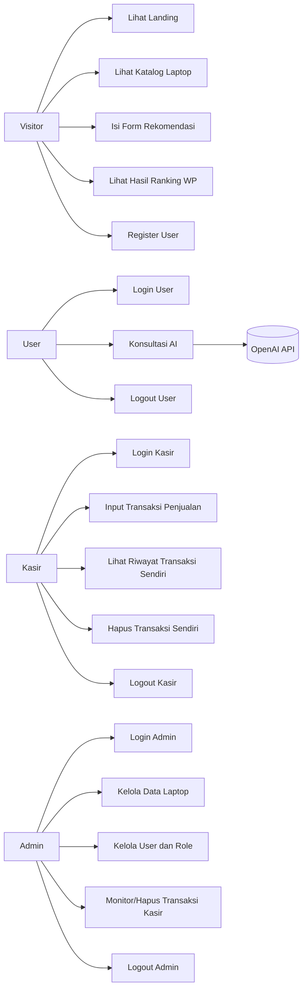
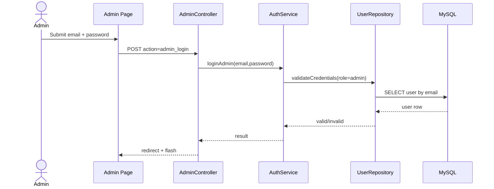
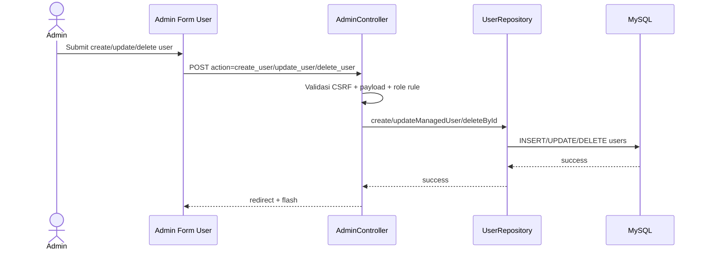
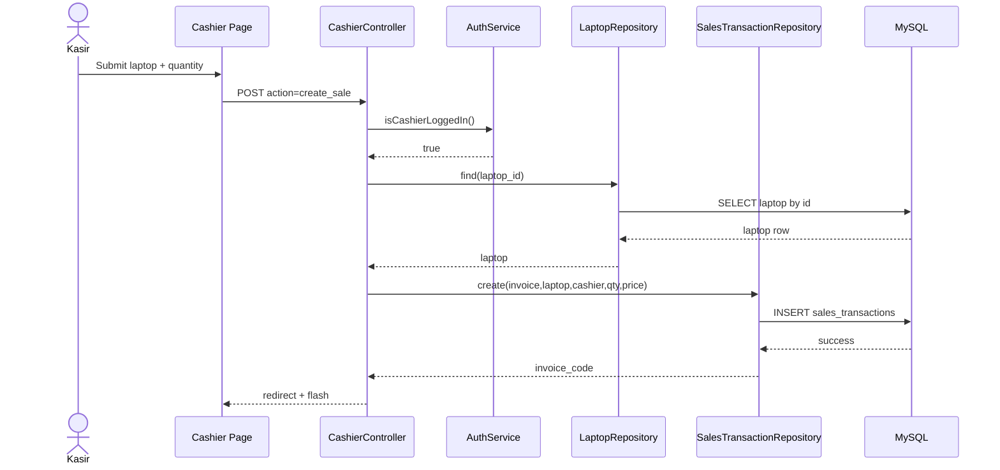
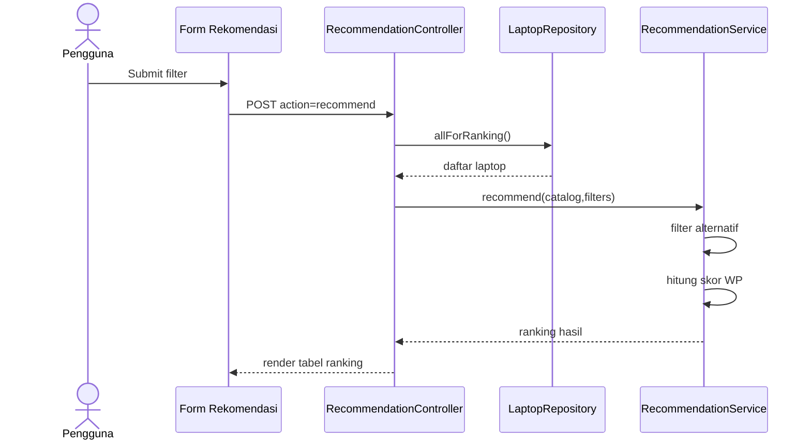
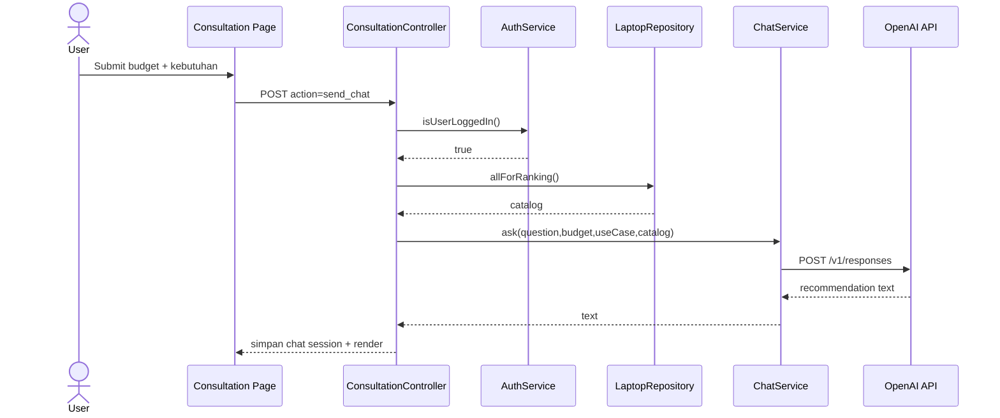
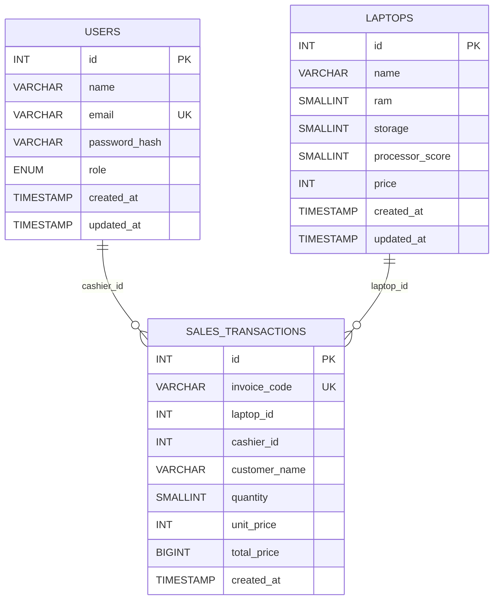

# Sistem Pendukung Keputusan Pemilihan Spek Laptop

Dokumen ini disusun untuk kebutuhan skripsi dan menjelaskan aplikasi secara end-to-end: tujuan, fitur, user flow, use case, sequence diagram, ERD, implementasi, dan pengujian.

## 1. Ringkasan Penelitian

### 1.1 Latar Belakang
Pemilihan laptop sering dilakukan berdasarkan persepsi subjektif dan promosi produk, bukan analisis kriteria yang terukur. Hal ini dapat menyebabkan perangkat yang dipilih tidak sesuai kebutuhan komputasi maupun batas anggaran pengguna.

### 1.2 Rumusan Masalah
1. Bagaimana menyediakan sistem rekomendasi laptop yang objektif berdasarkan multi-kriteria?
2. Bagaimana menggabungkan proses perhitungan SPK dengan antarmuka yang mudah dipahami pengguna awam?
3. Bagaimana menerapkan pembagian hak akses 3 role (`admin`, `kasir`, `user`) agar operasional data dan transaksi tetap terkontrol?

### 1.3 Tujuan
1. Membangun aplikasi SPK pemilihan laptop berbasis web menggunakan metode Weighted Product.
2. Menyediakan proses evaluasi alternatif laptop berdasarkan RAM, Storage, Prosesor, dan Harga.
3. Menyediakan modul admin untuk kelola master data dan user, modul kasir untuk transaksi penjualan, dan modul user untuk konsultasi AI setelah login.

### 1.4 Batasan Masalah
1. Kriteria yang digunakan: `ram`, `storage`, `processor_score`, `price`.
2. Bobot default: RAM 30%, Storage 20%, Prosesor 30%, Harga 20%.
3. Metode SPK: Weighted Product (WP).
4. Penyimpanan data utama di MySQL (`users`, `laptops`, `sales_transactions`).
5. Riwayat chat AI disimpan pada session, bukan database.

## 2. Gambaran Sistem

### 2.1 Aktor Sistem
1. Admin
2. Kasir
3. User
4. Visitor (belum login)
5. OpenAI API (sistem eksternal untuk fitur konsultasi)

### 2.2 Fitur Utama
1. Landing page bertema marketplace untuk pengenalan sistem.
2. Katalog laptop terpisah dengan fitur pencarian.
3. Form rekomendasi terpisah untuk proses WP.
4. Halaman rekomendasi (hasil ranking + penjelasan).
5. Konsultasi AI (hanya role `user` yang sudah login).
6. Admin panel (login admin, CRUD laptop, manajemen user role, monitoring transaksi kasir).
7. Kasir panel (login kasir, input transaksi penjualan laptop, hapus transaksi milik sendiri).
8. Navbar dinamis berdasarkan sesi role aktif.
9. Keamanan dasar: CSRF token, password hashing, session regeneration, prepared statement PDO.

### 2.3 Teknologi
1. Backend: PHP 8 (native)
2. Database: MySQL (Laragon)
3. Frontend: HTML + CSS native
4. HTTP Client API AI: cURL
5. Server lokal: Apache (Laragon)

## 3. Arsitektur dan Struktur Proyek

### 3.1 Arsitektur
Aplikasi menerapkan pola berlapis (layered):
1. `Controller`: menangani request/response.
2. `Service`: logika bisnis (auth, rekomendasi WP, chat AI).
3. `Repository`: akses data MySQL.
4. `View`: rendering HTML.
5. `Core`: environment loader, session, CSRF, DB connection, view renderer.

### 3.2 Struktur Direktori
```text
app/
  Config/
  Controllers/
  Core/
  Helpers/
  Repositories/
  Services/
  Views/
database/
  schema.sql
public/
  assets/css/style.css
  index.php
README.md
```

### 3.3 Daftar Halaman / Routing
| Halaman | URL | Keterangan |
|---|---|---|
| Landing | `index.php?page=home` | Ringkasan sistem, highlight, akses cepat |
| Katalog | `index.php?page=katalog` | Daftar laptop + pencarian |
| Form Rekomendasi | `index.php?page=form-rekomendasi` | Input filter + perhitungan WP |
| Rekomendasi | `index.php?page=rekomendasi` | Halaman rekomendasi penuh |
| Konsultasi | `index.php?page=konsultasi` | Auth user + konsultasi AI |
| Kasir | `index.php?page=cashier` | Auth kasir + transaksi penjualan laptop |
| Admin | `index.php?page=admin` | Auth admin + kelola laptop, user, dan monitoring transaksi |

## 4. Requirement Sistem

### 4.1 Kebutuhan Fungsional
1. Sistem menampilkan daftar laptop dari database.
2. Sistem menghitung ranking laptop dengan metode Weighted Product.
3. Admin dapat login, logout, dan kelola data laptop (CRUD + reset default).
4. Admin dapat kelola data user (`admin`, `kasir`, `user`) termasuk tambah, ubah, dan hapus.
5. Admin dapat memantau serta menghapus transaksi kasir.
6. Kasir dapat login, logout, menambah transaksi laptop, melihat riwayat transaksi sendiri, dan menghapus transaksi sendiri.
7. User dapat register dan login.
8. User dapat memakai konsultasi AI setelah login.
9. Role selain `user` tidak dapat login di modul konsultasi AI.

### 4.2 Kebutuhan Non-Fungsional
1. Keamanan dasar request form menggunakan CSRF token.
2. Password user/admin/kasir disimpan dalam bentuk hash (`password_hash`).
3. Query database menggunakan prepared statement PDO.
4. Session ID diregenerasi saat login.
5. Antarmuka responsif untuk desktop dan mobile.

### 4.3 Matriks Hak Akses
| Fitur | Visitor | User | Kasir | Admin |
|---|---|---|---|---|
| Lihat katalog laptop | Ya | Ya | Ya | Ya |
| Hitung rekomendasi WP | Ya | Ya | Ya | Ya |
| Konsultasi AI | Tidak | Ya (setelah login) | Tidak | Tidak |
| Input transaksi kasir | Tidak | Tidak | Ya | Tidak |
| Kelola master laptop | Tidak | Tidak | Tidak | Ya |
| Kelola akun user/role | Tidak | Tidak | Tidak | Ya |
| Monitor/hapus transaksi | Tidak | Tidak | Terbatas (milik sendiri) | Ya (semua) |

## 5. User Flow

### 5.1 User Flow Visitor/User
1. Visitor membuka landing page.
2. Visitor melihat katalog atau form rekomendasi.
3. Visitor melakukan register/login role `user` jika ingin konsultasi AI.
4. User mengirim budget + kebutuhan.
5. Sistem mengirim prompt ke OpenAI API dan menampilkan balasan.

### 5.2 User Flow Kasir
1. Kasir membuka halaman kasir.
2. Kasir login dengan akun role `cashier`.
3. Kasir memilih laptop, isi quantity, opsional isi nama pembeli.
4. Sistem menyimpan transaksi dengan kode invoice.
5. Kasir melihat riwayat transaksi dan bisa menghapus transaksi miliknya.

### 5.3 User Flow Admin
1. Admin login pada halaman admin.
2. Admin mengelola master laptop (CRUD + reset default).
3. Admin mengelola akun user (buat/ubah/hapus role `admin`, `cashier`, `user`).
4. Admin memantau seluruh transaksi kasir.
5. Admin logout.

## 6. Use Case

### 6.1 Diagram Use Case


### 6.2 Daftar Use Case
| Kode | Use Case | Aktor | Deskripsi |
|---|---|---|---|
| UC1 | Lihat Landing | Visitor | Melihat ringkasan aplikasi dan navigasi utama |
| UC2 | Lihat Katalog Laptop | Visitor/User/Kasir/Admin | Menampilkan data laptop + pencarian |
| UC3 | Isi Form Rekomendasi | Visitor/User/Kasir/Admin | Mengisi filter kriteria WP |
| UC4 | Lihat Hasil Ranking WP | Visitor/User/Kasir/Admin | Menampilkan ranking laptop berdasarkan skor WP |
| UC5 | Register User | Visitor | Membuat akun role `user` |
| UC6 | Login User | User | Akses fitur konsultasi AI |
| UC7 | Konsultasi AI | User | Mengirim kebutuhan dan budget ke model AI |
| UC8 | Logout User | User | Mengakhiri sesi user |
| UC9 | Login Kasir | Kasir | Akses modul transaksi kasir |
| UC10 | Input Transaksi Penjualan | Kasir | Menyimpan transaksi laptop |
| UC11 | Lihat Riwayat Transaksi Sendiri | Kasir | Melihat transaksi kasir yang sedang login |
| UC12 | Hapus Transaksi Sendiri | Kasir | Menghapus transaksi yang dibuat kasir sendiri |
| UC13 | Logout Kasir | Kasir | Mengakhiri sesi kasir |
| UC14 | Login Admin | Admin | Akses dashboard admin |
| UC15 | Kelola Data Laptop | Admin | CRUD + reset data default laptop |
| UC16 | Kelola User dan Role | Admin | Tambah/ubah/hapus akun dengan role berbeda |
| UC17 | Monitor/Hapus Transaksi Kasir | Admin | Monitoring seluruh transaksi kasir |
| UC18 | Logout Admin | Admin | Mengakhiri sesi admin |

## 7. Sequence Diagram

### 7.1 Sequence Login Admin


### 7.2 Sequence Admin Kelola User


### 7.3 Sequence Kasir Input Transaksi


### 7.4 Sequence Rekomendasi Weighted Product


### 7.5 Sequence Konsultasi AI (Role User)


## 8. Metode Weighted Product

### 8.1 Kriteria
1. `ram` (benefit)
2. `storage` (benefit)
3. `processor_score` (benefit)
4. `price` (cost)

### 8.2 Bobot
- RAM = 0.3
- Storage = 0.2
- Prosesor = 0.3
- Harga = 0.2

### 8.3 Formula Implementasi
Skor setiap laptop `i`:

```text
S_i = (ram^0.3) * (storage^0.2) * (processor^0.3) * (price^-0.2)
```

Semakin tinggi `S_i`, semakin tinggi prioritas rekomendasi.

## 9. Desain Basis Data (ERD)

### 9.1 ERD


### 9.2 Data Dictionary Singkat

#### Tabel `users`
| Kolom | Tipe | Keterangan |
|---|---|---|
| id | INT UNSIGNED | Primary key |
| name | VARCHAR(120) | Nama akun |
| email | VARCHAR(190) | Unik, identitas login |
| password_hash | VARCHAR(255) | Hash password |
| role | ENUM(admin,cashier,user) | Role akun |
| created_at | TIMESTAMP | Waktu pembuatan |
| updated_at | TIMESTAMP | Waktu update |

#### Tabel `laptops`
| Kolom | Tipe | Keterangan |
|---|---|---|
| id | INT UNSIGNED | Primary key |
| name | VARCHAR(160) | Nama laptop |
| ram | SMALLINT UNSIGNED | Nilai RAM |
| storage | SMALLINT UNSIGNED | Nilai storage |
| processor_score | SMALLINT UNSIGNED | Skor prosesor |
| price | INT UNSIGNED | Harga (Rp) |
| created_at | TIMESTAMP | Waktu pembuatan |
| updated_at | TIMESTAMP | Waktu update |

#### Tabel `sales_transactions`
| Kolom | Tipe | Keterangan |
|---|---|---|
| id | INT UNSIGNED | Primary key |
| invoice_code | VARCHAR(40) | Kode invoice unik |
| laptop_id | INT UNSIGNED | Referensi laptop terjual |
| cashier_id | INT UNSIGNED | Referensi user role kasir |
| customer_name | VARCHAR(120) | Nama pembeli (opsional) |
| quantity | SMALLINT UNSIGNED | Jumlah unit |
| unit_price | INT UNSIGNED | Harga per unit |
| total_price | BIGINT UNSIGNED | Quantity x unit_price |
| created_at | TIMESTAMP | Waktu transaksi |

## 10. Keamanan Aplikasi

1. CSRF token pada semua form mutasi data.
2. Session regeneration saat login.
3. Password hashing (`password_hash`, `password_verify`).
4. Prepared statement PDO untuk query input dinamis.
5. Validasi role saat login (`admin`, `cashier`, `user`) agar tidak terjadi cross-login antar modul.
6. Proteksi admin agar tidak dapat menghapus diri sendiri atau menurunkan admin terakhir.

## 11. Setup dan Menjalankan Aplikasi

### 11.1 Prasyarat
1. Laragon (Apache + MySQL)
2. PHP 8.x
3. MySQL 8.x / MariaDB kompatibel

### 11.2 Langkah Instalasi
1. Letakkan proyek di `C:\laragon\www\pemilihan-laptop`.
2. Import `database/schema.sql`.
3. Isi file `.env`.
4. Jalankan Apache + MySQL di Laragon.
5. Akses `http://localhost/pemilihan-laptop/`.

Catatan: saat bootstrap, aplikasi otomatis memastikan enum role user mendukung `cashier` dan memastikan tabel `sales_transactions` tersedia.

### 11.3 Konfigurasi `.env` minimal
```env
APP_NAME="SPK Pemilihan Laptop"
DB_HOST=127.0.0.1
DB_PORT=3306
DB_NAME=spk_laptop
DB_USER=root
DB_PASS=

ADMIN_EMAIL=admin@laptop.local
ADMIN_PASSWORD=admin123
CASHIER_EMAIL=cashier@laptop.local
CASHIER_PASSWORD=cashier123
USER_EMAIL=user@laptop.local
USER_PASSWORD=user123

OPENAI_API_KEY=
OPENAI_MODEL=gpt-4.1-mini
```

## 12. Akun Default

1. Admin: mengikuti `ADMIN_EMAIL` dan `ADMIN_PASSWORD` pada `.env`.
2. Kasir: mengikuti `CASHIER_EMAIL` dan `CASHIER_PASSWORD` pada `.env`.
3. User: mengikuti `USER_EMAIL` dan `USER_PASSWORD` pada `.env`.

Akun default akan di-ensure saat bootstrap aplikasi dijalankan.

## 13. Skenario Uji Fungsional (Ringkas)

1. Login admin valid/invalid.
2. Admin tambah/edit/hapus/reset data laptop.
3. Admin tambah/edit/hapus user dan role.
4. Validasi admin tidak bisa hapus akun admin aktif sendiri.
5. Login kasir valid/invalid.
6. Kasir membuat transaksi, melihat riwayat, dan hapus transaksi milik sendiri.
7. Admin dapat melihat dan menghapus transaksi kasir.
8. Register user baru, lalu login user.
9. Validasi role `admin`/`kasir` tidak bisa login di halaman konsultasi user.
10. User kirim konsultasi AI dengan budget valid.
11. Validasi error saat budget kosong/invalid.
12. Validasi proteksi CSRF pada form POST.

## 14. Pengembangan Lanjutan

1. Menyimpan histori konsultasi AI ke database.
2. Menambahkan status transaksi (paid/unpaid/refund) dan metode pembayaran.
3. Menyediakan export laporan transaksi dan ranking ke PDF/Excel.
4. Menambah kriteria SPK (misal GPU, baterai, berat laptop).
5. Menyediakan audit trail untuk perubahan data user dan laptop oleh admin.

---

Jika dokumen ini dipakai untuk skripsi, bagian pada Bab Analisis dan Perancangan dapat mengacu ke: **Bagian 5 (User Flow), Bagian 6 (Use Case), Bagian 7 (Sequence Diagram), dan Bagian 9 (ERD)**.
