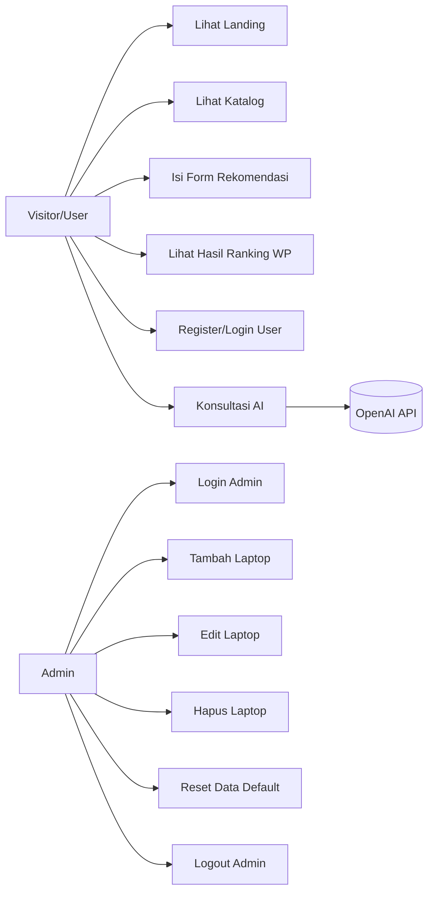
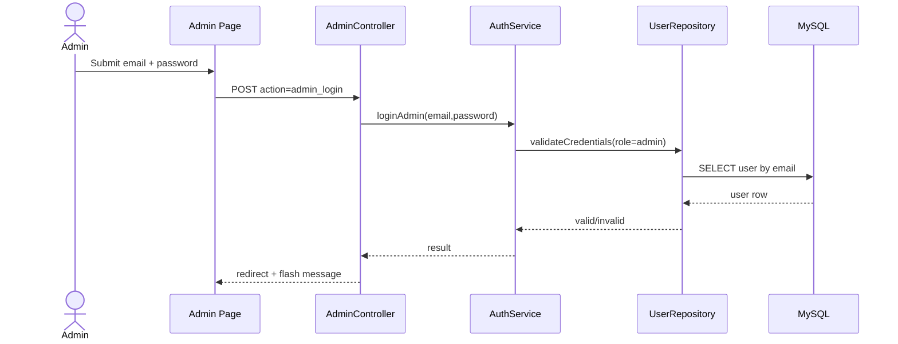
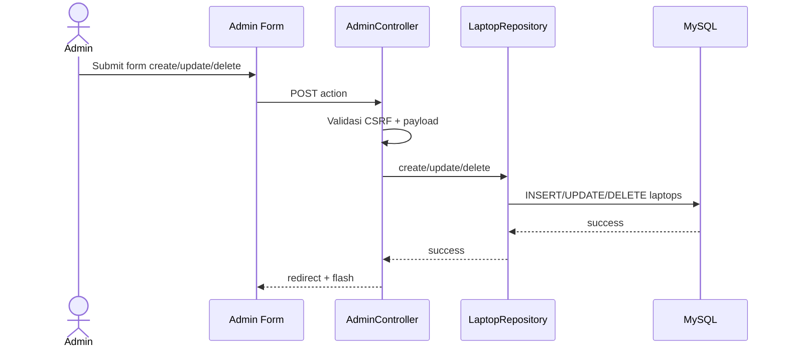
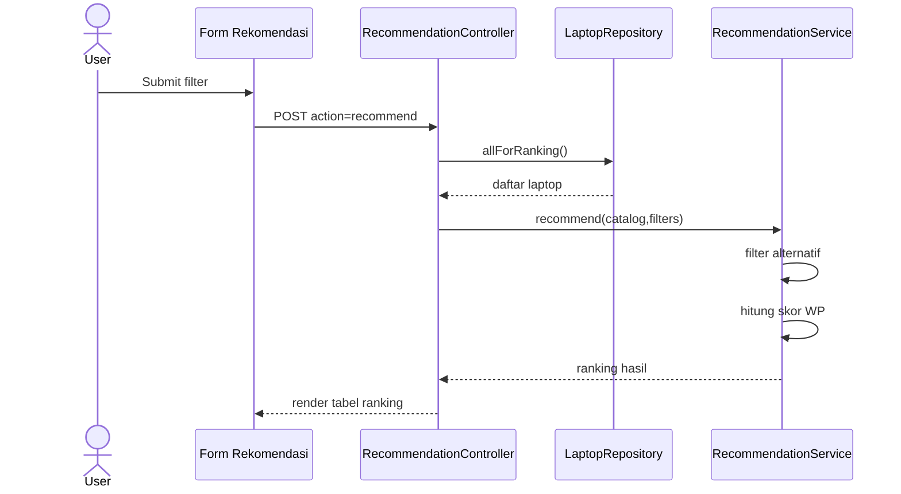
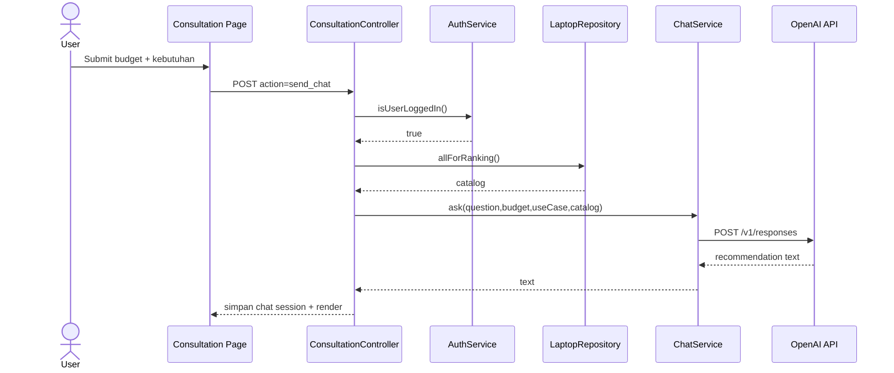
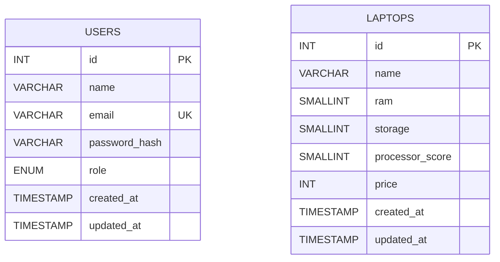

# Sistem Pendukung Keputusan Pemilihan Spek Laptop

Dokumen ini disusun untuk kebutuhan skripsi dan menjelaskan aplikasi secara end-to-end: tujuan, fitur, user flow, use case, sequence diagram, ERD, implementasi, dan pengujian.

## 1. Ringkasan Penelitian

### 1.1 Latar Belakang
Pemilihan laptop sering dilakukan berdasarkan persepsi subjektif dan promosi produk, bukan analisis kriteria yang terukur. Hal ini dapat menyebabkan perangkat yang dipilih tidak sesuai kebutuhan komputasi maupun batas anggaran pengguna.

### 1.2 Rumusan Masalah
1. Bagaimana menyediakan sistem rekomendasi laptop yang objektif berdasarkan multi-kriteria?
2. Bagaimana menggabungkan proses perhitungan SPK dengan antarmuka yang mudah dipahami pengguna awam?
3. Bagaimana menyediakan pengelolaan data laptop yang aman dan terstruktur untuk admin?

### 1.3 Tujuan
1. Membangun aplikasi SPK pemilihan laptop berbasis web menggunakan metode Weighted Product.
2. Menyediakan proses evaluasi alternatif laptop berdasarkan RAM, Storage, Prosesor, dan Harga.
3. Menyediakan modul admin untuk kelola data laptop dan modul konsultasi AI untuk pendampingan pengguna.

### 1.4 Batasan Masalah
1. Kriteria yang digunakan: `ram`, `storage`, `processor_score`, `price`.
2. Bobot default: RAM 30%, Storage 20%, Prosesor 30%, Harga 20%.
3. Metode SPK: Weighted Product (WP).
4. Penyimpanan data utama di MySQL (`users`, `laptops`).
5. Riwayat chat disimpan pada session, bukan database.

## 2. Gambaran Sistem

### 2.1 Aktor Sistem
1. Admin
2. User (pengguna umum)
3. Visitor (belum login)
4. OpenAI API (sistem eksternal untuk fitur konsultasi)

### 2.2 Fitur Utama
1. Landing page bertema marketplace untuk pengenalan sistem.
2. Katalog laptop terpisah dengan fitur pencarian.
3. Form rekomendasi terpisah untuk proses WP.
4. Halaman rekomendasi (hasil ranking + penjelasan).
5. Konsultasi AI (register/login user, kirim kebutuhan + budget).
6. Admin panel (login admin, CRUD laptop, reset data default).
7. Navbar dinamis: mode customer dan mode admin.
8. Keamanan dasar: CSRF token, password hashing, session regeneration, prepared statement PDO.

### 2.3 Teknologi
1. Backend: PHP 8 (native)
2. Database: MySQL (Laragon)
3. Frontend: HTML + CSS native
4. HTTP Client API AI: cURL
5. Server lokal: Apache (Laragon)

## 3. Arsitektur dan Struktur Proyek

### 3.1 Arsitektur
Aplikasi menerapkan pola berlapis (layered):
1. `Controller`: menangani request/response.
2. `Service`: logika bisnis (auth, rekomendasi WP, chat AI).
3. `Repository`: akses data MySQL.
4. `View`: rendering HTML.
5. `Core`: environment loader, session, CSRF, DB connection, view renderer.

### 3.2 Struktur Direktori
```text
app/
  Config/
  Controllers/
  Core/
  Helpers/
  Repositories/
  Services/
  Views/
database/
  schema.sql
public/
  assets/css/style.css
  .htaccess
  index.php
.env.example
README.md
```

### 3.3 Daftar Halaman / Routing
| Halaman | URL | Keterangan |
|---|---|---|
| Landing | `index.php?page=home` | Ringkasan sistem, highlight, akses cepat |
| Katalog | `index.php?page=katalog` | Daftar laptop + pencarian |
| Form Rekomendasi | `index.php?page=form-rekomendasi` | Input filter + perhitungan WP |
| Rekomendasi | `index.php?page=rekomendasi` | Halaman rekomendasi penuh |
| Konsultasi | `index.php?page=konsultasi` | Auth user + konsultasi AI |
| Admin | `index.php?page=admin` | Auth admin + CRUD laptop |

## 4. Requirement Sistem

### 4.1 Kebutuhan Fungsional
1. Sistem menampilkan daftar laptop dari database.
2. Admin dapat login dan logout.
3. Admin dapat menambah, mengubah, menghapus, dan reset data laptop.
4. User dapat register dan login.
5. User dapat meminta rekomendasi AI berdasarkan budget dan kebutuhan.
6. Sistem dapat menghitung ranking laptop dengan metode Weighted Product.
7. Sistem dapat memfilter alternatif berdasarkan nama, RAM, storage, prosesor, dan harga maksimal.

### 4.2 Kebutuhan Non-Fungsional
1. Keamanan dasar request form menggunakan CSRF token.
2. Password user/admin disimpan dalam bentuk hash (`password_hash`).
3. Query database menggunakan prepared statement PDO.
4. Antarmuka responsif (desktop dan mobile).
5. Waktu respon halaman lokal sesuai performa Laragon/MySQL lokal.

## 5. User Flow

### 5.1 User Flow Visitor/User
1. Buka landing.
2. Pindah ke katalog atau form rekomendasi.
3. Pilih kriteria rekomendasi.
4. Lihat hasil ranking.
5. Opsional: ke konsultasi AI.
6. Jika belum punya akun, register.
7. Login user.
8. Kirim budget + kebutuhan ke AI.
9. Baca saran AI dan reset riwayat bila diperlukan.

### 5.2 User Flow Admin
1. Buka halaman admin.
2. Login admin.
3. Navbar berubah ke mode admin.
4. Kelola data laptop (CRUD).
5. Reset data ke default bila diperlukan.
6. Logout admin.

## 6. Use Case

### 6.1 Diagram Use Case


### 6.2 Daftar Use Case dan Deskripsi Singkat
| Kode | Use Case | Aktor | Deskripsi |
|---|---|---|---|
| UC1 | Lihat Landing | Visitor/User | Melihat ringkasan aplikasi dan navigasi utama |
| UC2 | Lihat Katalog | Visitor/User | Menampilkan data laptop + pencarian |
| UC3 | Isi Form Rekomendasi | Visitor/User | Mengisi filter kriteria WP |
| UC4 | Lihat Hasil Ranking | Visitor/User | Menampilkan ranking laptop berdasarkan skor WP |
| UC5 | Register/Login User | User | Akses fitur konsultasi AI |
| UC6 | Konsultasi AI | User | Mengirim kebutuhan dan budget ke model AI |
| UC7 | Login Admin | Admin | Akses fitur kelola data |
| UC8 | Tambah Laptop | Admin | Menambahkan data alternatif laptop |
| UC9 | Edit Laptop | Admin | Memperbarui data alternatif |
| UC10 | Hapus Laptop | Admin | Menghapus alternatif dari katalog |
| UC11 | Reset Data Default | Admin | Mengembalikan data awal bawaan sistem |
| UC12 | Logout Admin | Admin | Mengakhiri sesi admin |

## 7. Sequence Diagram

### 7.1 Sequence Login Admin


### 7.2 Sequence CRUD Laptop (Admin)


### 7.3 Sequence Rekomendasi Weighted Product


### 7.4 Sequence Konsultasi AI


## 8. Metode Weighted Product

### 8.1 Kriteria
1. `ram` (benefit)
2. `storage` (benefit)
3. `processor_score` (benefit)
4. `price` (cost)

### 8.2 Bobot
- RAM = 0.3
- Storage = 0.2
- Prosesor = 0.3
- Harga = 0.2

### 8.3 Formula Implementasi
Skor setiap laptop `i`:

```text
S_i = (ram^0.3) * (storage^0.2) * (processor^0.3) * (price^-0.2)
```

Semakin tinggi `S_i`, semakin tinggi prioritas rekomendasi.

## 9. Desain Basis Data (ERD)

### 9.1 ERD


Catatan: saat ini tidak ada relasi FK antar tabel karena `users` dan `laptops` dipakai pada konteks modul berbeda. Riwayat chat disimpan di session (`chat_messages`) sehingga tidak masuk ERD database.

### 9.2 Data Dictionary Singkat

#### Tabel `users`
| Kolom | Tipe | Keterangan |
|---|---|---|
| id | INT UNSIGNED | Primary key |
| name | VARCHAR(120) | Nama user/admin |
| email | VARCHAR(190) | Unik, identitas login |
| password_hash | VARCHAR(255) | Hash password |
| role | ENUM(admin,user) | Role akun |
| created_at | TIMESTAMP | Waktu pembuatan |
| updated_at | TIMESTAMP | Waktu update |

#### Tabel `laptops`
| Kolom | Tipe | Keterangan |
|---|---|---|
| id | INT UNSIGNED | Primary key |
| name | VARCHAR(160) | Nama laptop |
| ram | SMALLINT UNSIGNED | Nilai RAM |
| storage | SMALLINT UNSIGNED | Nilai storage |
| processor_score | SMALLINT UNSIGNED | Skor prosesor |
| price | INT UNSIGNED | Harga (Rp) |
| created_at | TIMESTAMP | Waktu pembuatan |
| updated_at | TIMESTAMP | Waktu update |

## 10. Keamanan Aplikasi

1. CSRF token pada semua form mutasi data.
2. Session regeneration saat login.
3. Password hashing (`password_hash`, `password_verify`).
4. Prepared statement PDO untuk query input dinamis.
5. Validasi input pada controller/service (email, password, numeric field, dsb).

## 11. Setup dan Menjalankan Aplikasi

### 11.1 Prasyarat
1. Laragon (Apache + MySQL)
2. PHP 8.x
3. MySQL 8.x / MariaDB kompatibel

### 11.2 Langkah Instalasi
1. Letakkan proyek di `C:\laragon\www\pemilihan-laptop`.
2. Import `database/schema.sql`.
3. Salin `.env.example` menjadi `.env` lalu isi konfigurasi.
4. Jalankan Apache + MySQL di Laragon.
5. Akses `http://localhost/pemilihan-laptop/`.

### 11.3 Konfigurasi `.env` minimal
```env
APP_NAME="SPK Pemilihan Laptop"
DB_HOST=127.0.0.1
DB_PORT=3306
DB_NAME=spk_laptop
DB_USER=root
DB_PASS=
ADMIN_EMAIL=admin@laptop.local
ADMIN_PASSWORD=admin123
USER_EMAIL=user@laptop.local
USER_PASSWORD=user123
OPENAI_API_KEY=
OPENAI_MODEL=gpt-4.1-mini
```

## 12. Akun Default

1. Admin: mengikuti `ADMIN_EMAIL` dan `ADMIN_PASSWORD` pada `.env`.
2. User default: mengikuti `USER_EMAIL` dan `USER_PASSWORD` pada `.env`.

Akun default akan di-ensure saat bootstrap aplikasi dijalankan.

## 13. Skenario Uji Fungsional (Ringkas)

1. Login admin valid/invalid.
2. Tambah/edit/hapus/reset data laptop.
3. Filter rekomendasi menghasilkan ranking.
4. Register user baru, lalu login.
5. Kirim konsultasi AI dengan budget valid.
6. Validasi error saat budget kosong/invalid.
7. Validasi proteksi CSRF pada form POST.
8. Validasi navbar berubah saat admin login.

## 14. Pengembangan Lanjutan

1. Menyimpan histori konsultasi AI ke database.
2. Menambah kriteria SPK (misal GPU, baterai, berat laptop).
3. Menyediakan bobot dinamis yang dapat diubah user.
4. Menambah role-based middleware untuk pemisahan hak akses lebih granular.
5. Menyediakan export laporan ranking (PDF/Excel) untuk dokumentasi keputusan.

---

Jika dokumen ini dipakai untuk skripsi, bagian pada Bab Analisis dan Perancangan dapat langsung mengacu ke: **Bagian 5 (User Flow), Bagian 6 (Use Case), Bagian 7 (Sequence Diagram), dan Bagian 9 (ERD)**.
