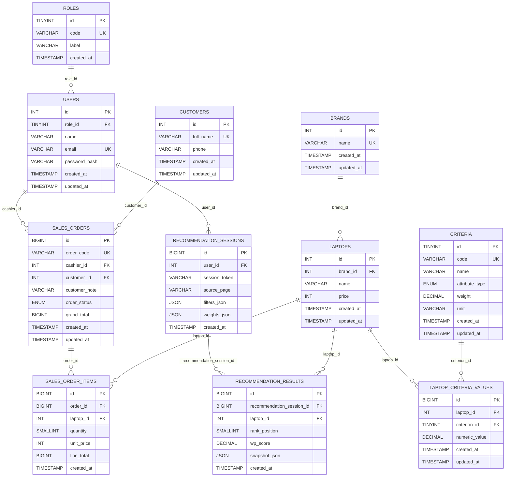

# Sistem Pendukung Keputusan Pemilihan Spek Laptop

Dokumen ini adalah versi terbaru untuk kebutuhan skripsi setelah refactor database ke model yang lebih kompleks, ter-normalisasi, dan memiliki relasi lengkap.

## 1. Ringkasan Penelitian

### 1.1 Latar Belakang
Pemilihan laptop sering tidak objektif karena pengguna hanya melihat iklan atau asumsi merek. Sistem ini membantu pengambilan keputusan berbasis data terukur dengan metode Weighted Product (WP).

### 1.2 Rumusan Masalah
1. Bagaimana menyediakan rekomendasi laptop multi-kriteria yang objektif?
2. Bagaimana menggabungkan modul SPK dengan modul operasional (admin dan kasir) dalam satu sistem?
3. Bagaimana merancang database yang kompleks, konsisten, dan sesuai standar normalisasi untuk skripsi?

### 1.3 Tujuan
1. Membangun aplikasi SPK pemilihan laptop berbasis PHP + MySQL.
2. Mengimplementasikan WP dengan kriteria RAM, Storage, Processor, dan Harga.
3. Menerapkan database ter-normalisasi dengan relasi master, transaksi, dan histori analitik.

### 1.4 Batasan Masalah
1. Kriteria utama WP: `ram`, `storage`, `processor`, `price`.
2. Bobot default: RAM 0.3, Storage 0.2, Processor 0.3, Harga 0.2.
3. Riwayat chat AI masih disimpan di session.
4. Riwayat proses rekomendasi WP disimpan ke database.

## 2. Gambaran Sistem

### 2.1 Aktor Sistem
1. Admin
2. Kasir
3. User
4. Visitor
5. OpenAI API (eksternal)

### 2.2 Fitur Utama
1. Landing page + katalog laptop.
2. Form rekomendasi WP dan ranking hasil.
3. Panel admin: kelola laptop, user, dan monitoring transaksi.
4. Panel kasir: input transaksi dan riwayat transaksi.
5. Konsultasi AI untuk role `user`.
6. Histori sesi rekomendasi tersimpan otomatis ke database.

### 2.3 Teknologi
1. Backend: PHP 8 native
2. Database: MySQL / MariaDB (InnoDB)
3. Frontend: HTML + CSS native
4. Integrasi AI: OpenAI Responses API

## 3. Arsitektur Aplikasi

Aplikasi menggunakan layered architecture:
1. `Controller` untuk request/response.
2. `Service` untuk business logic.
3. `Repository` untuk akses data SQL.
4. `View` untuk rendering.
5. `Core` untuk session, env, csrf, db bootstrap.

Struktur direktori:

```text
app/
  Config/
  Controllers/
  Core/
  Helpers/
  Repositories/
  Services/
  Views/
database/
  schema.sql
public/
  index.php
README.md
```

## 4. Metode Weighted Product

### 4.1 Kriteria
1. RAM (`benefit`)
2. Storage (`benefit`)
3. Processor (`benefit`)
4. Price (`cost`)

### 4.2 Formula

```text
S_i = (ram^w_ram) * (storage^w_storage) * (processor^w_processor) * (price^-w_price)
```

Bobot diambil dari tabel `criteria`, sehingga bisa diubah dari sisi data tanpa mengubah source code perhitungan.

## 5. Desain Database Kompleks

Model database sekarang memisahkan domain menjadi 3 area:
1. Master data (`roles`, `brands`, `criteria`, `laptops`, `laptop_criteria_values`, `users`)
2. Transaksi (`customers`, `sales_orders`, `sales_order_items`)
3. Analitik SPK (`recommendation_sessions`, `recommendation_results`)

### 5.1 ERD (Versi Baru)



### 5.2 Alasan Model Ini Lebih Kuat untuk Skripsi
1. Ada relasi 1:N dan M:N yang jelas.
2. Kriteria dipisah dari laptop (fleksibel dan ter-normalisasi).
3. Transaksi dipisah menjadi header-detail (`sales_orders` dan `sales_order_items`).
4. Proses analitik WP memiliki histori audit (`recommendation_sessions` dan `recommendation_results`).
5. Data role tidak lagi ENUM hardcoded, tapi tabel referensi (`roles`).

### 5.3 Data Dictionary Ringkas

1. `roles`: master role sistem.
2. `users`: akun autentikasi, referensi ke `roles`.
3. `brands`: master merek laptop.
4. `laptops`: master laptop (identitas + harga dasar + brand).
5. `criteria`: master kriteria SPK, termasuk bobot dan tipe atribut.
6. `laptop_criteria_values`: nilai setiap kriteria untuk setiap laptop.
7. `customers`: master pelanggan transaksi kasir.
8. `sales_orders`: header transaksi penjualan.
9. `sales_order_items`: detail item per transaksi.
10. `recommendation_sessions`: log input filter dan bobot saat rekomendasi dijalankan.
11. `recommendation_results`: log ranking hasil per sesi rekomendasi.

## 6. Normalisasi

### 6.1 Hasil Normalisasi
1. `users.role` dipisah ke tabel `roles`.
2. Nilai kriteria laptop dipisah ke tabel pivot `laptop_criteria_values`.
3. Data transaksi dipecah dari satu tabel menjadi header-detail.
4. Histori rekomendasi tidak bercampur dengan master laptop.

### 6.2 Dampak Positif
1. Redundansi data lebih kecil.
2. Integritas referensial lebih kuat (FK InnoDB).
3. Perubahan bobot kriteria lebih fleksibel.
4. Sangat cocok untuk pembahasan bab perancangan basis data skripsi.

## 7. Penyesuaian Implementasi

Perubahan kode utama:
1. `LaptopRepository` kini membaca data via relasi `brands` + pivot kriteria.
2. `UserRepository` kini menggunakan `role_id` (relasi ke `roles`).
3. `SalesTransactionRepository` kini memakai `sales_orders` + `sales_order_items`.
4. `RecommendationService` membaca bobot dari tabel `criteria` dan menyimpan histori rekomendasi.
5. Ditambahkan `RecommendationRepository` untuk penyimpanan log rekomendasi.

## 8. Migrasi dari Skema Lama

Aplikasi sekarang menyediakan fallback migrasi runtime:
1. Jika masih ada tabel lama `sales_transactions`, data akan dimigrasikan ke tabel baru.
2. Jika `users` lama masih berbasis ENUM `role`, data role akan dipetakan ke `roles` dan `role_id`.
3. Jika `laptops` lama masih punya kolom `ram/storage/processor_score`, nilainya dipindah ke `laptop_criteria_values`.

Catatan: untuk lingkungan baru, tetap disarankan import `database/schema.sql` terbaru.

## 9. Setup dan Menjalankan

### 9.1 Prasyarat
1. PHP 8.x
2. MySQL 8.x atau MariaDB kompatibel
3. Apache (misalnya Laragon)

### 9.2 Langkah Instalasi
1. Letakkan proyek di `C:\laragon\www\pemilihan-laptop`.
2. Import file `database/schema.sql` terbaru.
3. Isi `.env`.
4. Jalankan Apache + MySQL.
5. Akses `http://localhost/pemilihan-laptop/`.

### 9.3 Konfigurasi `.env` Minimal

```env
APP_NAME="SPK Pemilihan Laptop"
DB_HOST=127.0.0.1
DB_PORT=3306
DB_NAME=spk_laptop
DB_USER=root
DB_PASS=

ADMIN_EMAIL=admin@laptop.local
ADMIN_PASSWORD=admin123
CASHIER_EMAIL=cashier@laptop.local
CASHIER_PASSWORD=cashier123
USER_EMAIL=user@laptop.local
USER_PASSWORD=user123

OPENAI_API_KEY=
OPENAI_MODEL=gpt-4.1-mini
```

## 10. Hak Akses Sistem

1. `admin`: kelola laptop, user, transaksi.
2. `cashier`: input dan kelola transaksi miliknya.
3. `user`: login frontend dan konsultasi AI.
4. `visitor`: lihat katalog dan rekomendasi tanpa login.

## 11. Skenario Uji Fungsional

1. Login admin/kasir/user valid dan invalid.
2. CRUD laptop pada struktur baru (dengan brand dan nilai kriteria).
3. CRUD user dengan role berbasis tabel relasi.
4. Input transaksi kasir ke skema header-detail.
5. Monitoring transaksi oleh admin.
6. Proses WP dan penyimpanan histori sesi rekomendasi.
7. Konsultasi AI role `user`.
8. Validasi CSRF dan session role.

## 12. Pengembangan Lanjutan

1. Menambahkan modul manajemen bobot kriteria via UI admin.
2. Menambahkan status pembayaran detail per order (multi-payment).
3. Menambahkan laporan periodik dari tabel histori rekomendasi.
4. Menyimpan histori chat AI ke database (bukan session).

---

Untuk kebutuhan Bab Analisis dan Perancangan skripsi, bagian penting yang bisa langsung dipakai adalah: **Bagian 5 (ERD baru), Bagian 6 (normalisasi), dan Bagian 8 (strategi migrasi skema)**.
