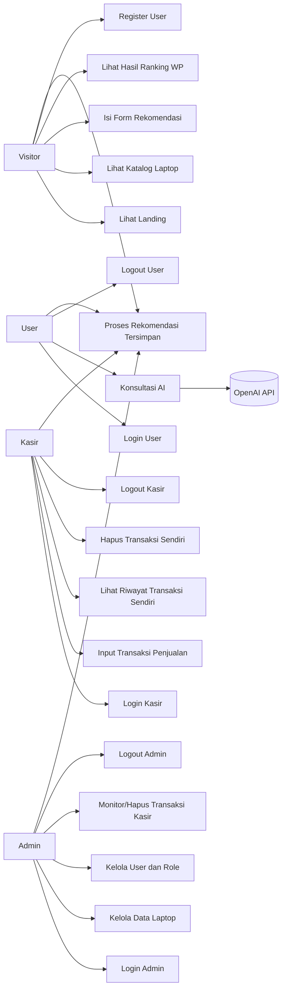
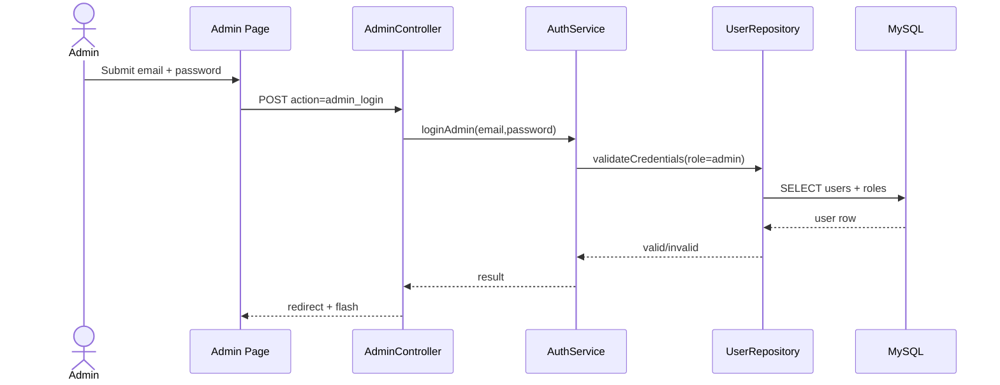
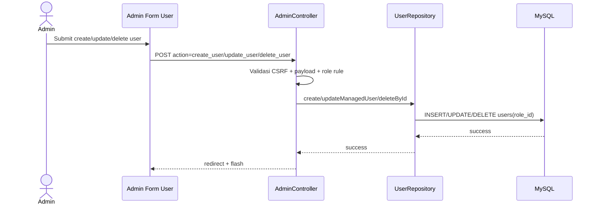
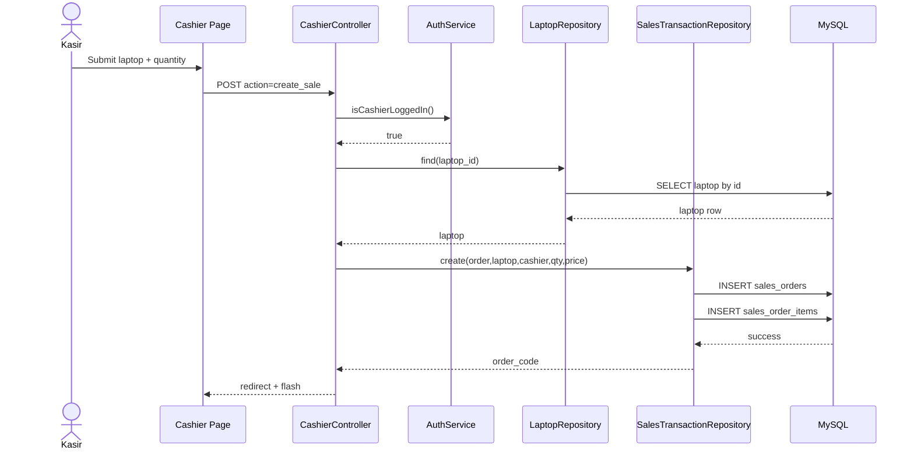
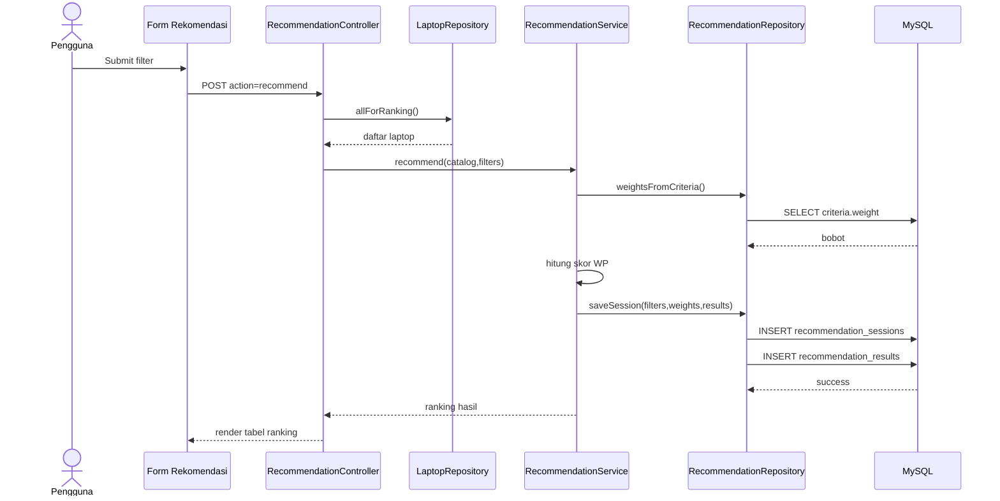
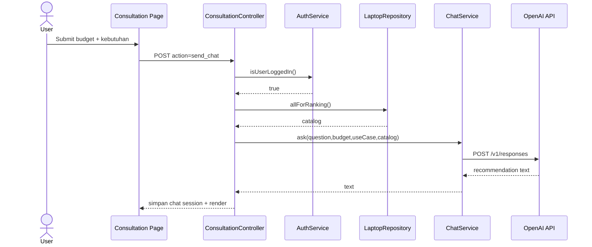
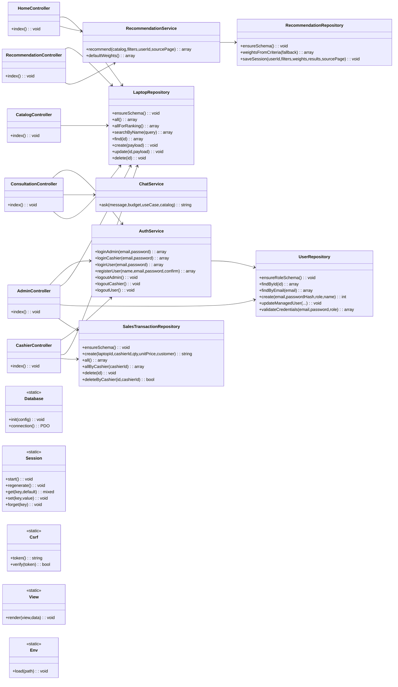
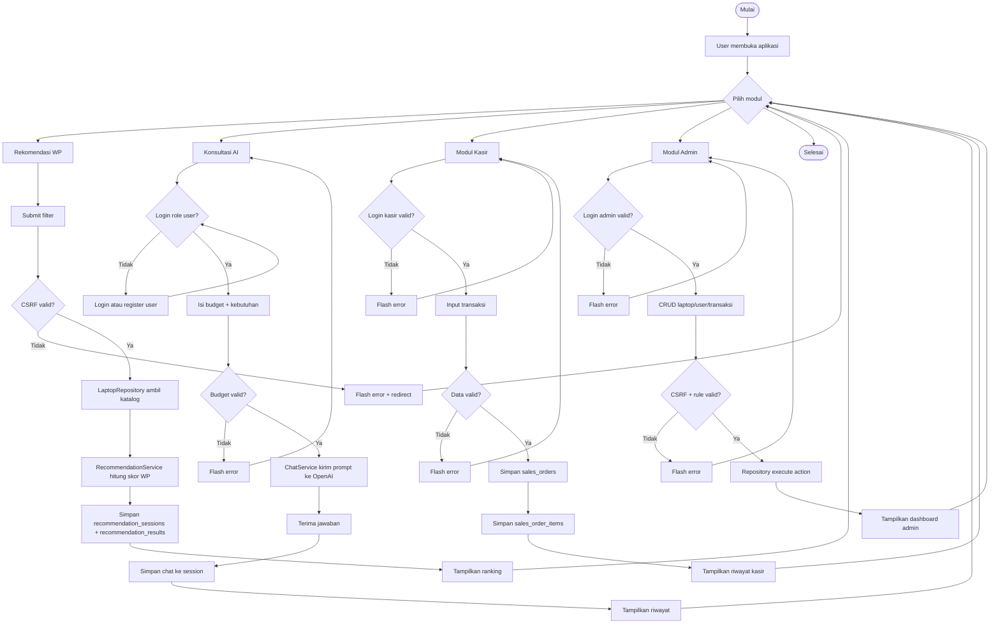
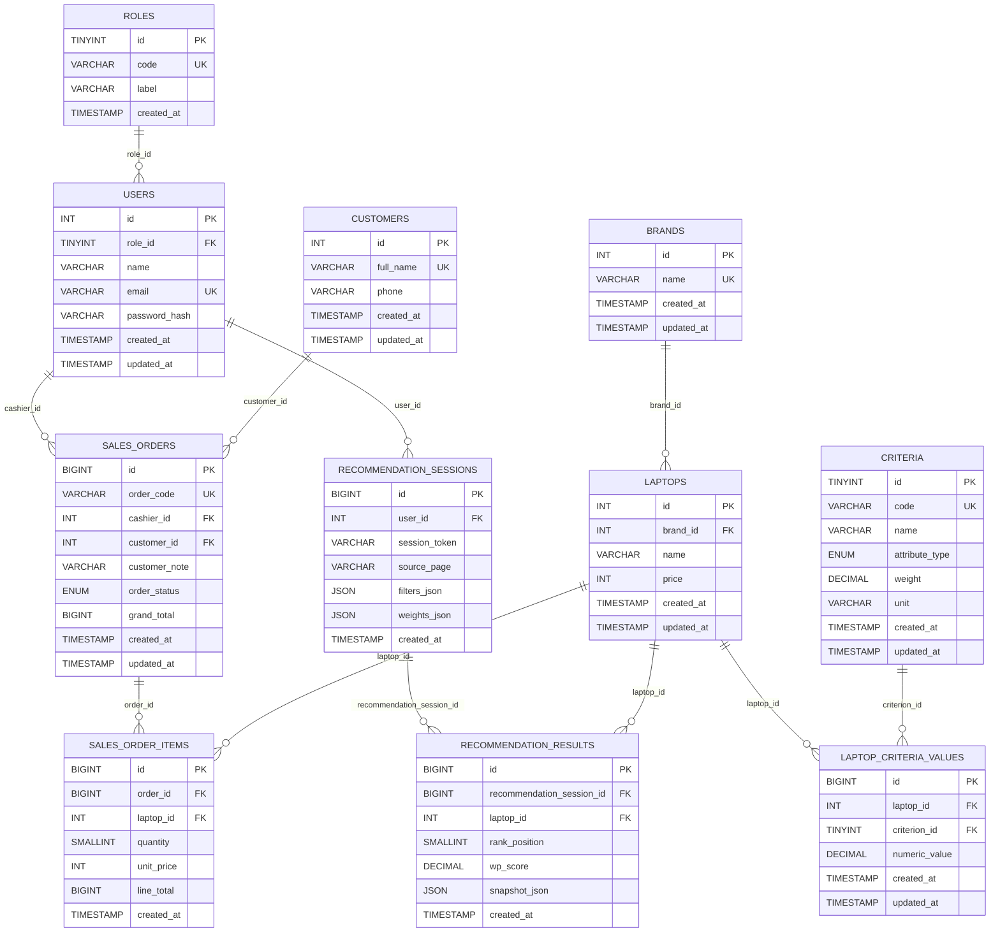

# Sistem Pendukung Keputusan Pemilihan Spek Laptop

Dokumen ini disusun untuk kebutuhan skripsi dan menjelaskan aplikasi secara end-to-end: latar belakang, requirement, user flow, use case, sequence diagram, class diagram, activity diagram, ERD, implementasi, dan pengujian.

## 1. Ringkasan Penelitian

### 1.1 Latar Belakang
Pemilihan laptop sering dilakukan berdasarkan persepsi subjektif dan promosi produk, bukan analisis kriteria terukur. Hal ini dapat menyebabkan perangkat yang dipilih tidak sesuai kebutuhan komputasi maupun batas anggaran pengguna.

### 1.2 Rumusan Masalah
1. Bagaimana menyediakan sistem rekomendasi laptop yang objektif berdasarkan multi-kriteria?
2. Bagaimana menggabungkan proses perhitungan SPK dengan antarmuka yang mudah dipahami pengguna awam?
3. Bagaimana merancang basis data yang kompleks, ter-normalisasi, dan relevan untuk mendukung kebutuhan skripsi?

### 1.3 Tujuan
1. Membangun aplikasi SPK pemilihan laptop berbasis web menggunakan metode Weighted Product.
2. Menyediakan proses evaluasi alternatif laptop berdasarkan RAM, Storage, Prosesor, dan Harga.
3. Menyediakan modul admin, kasir, user, serta histori perhitungan rekomendasi untuk kebutuhan analitik.

### 1.4 Batasan Masalah
1. Kriteria utama: `ram`, `storage`, `processor`, `price`.
2. Bobot default awal: RAM 30%, Storage 20%, Prosesor 30%, Harga 20%.
3. Metode SPK: Weighted Product (WP).
4. Histori chat AI masih disimpan di session.
5. Histori proses rekomendasi WP disimpan ke database.

## 2. Gambaran Sistem

### 2.1 Aktor Sistem
1. Admin
2. Kasir
3. User
4. Visitor (belum login)
5. OpenAI API (sistem eksternal untuk konsultasi AI)

### 2.2 Fitur Utama
1. Landing page bertema marketplace.
2. Katalog laptop + pencarian.
3. Form rekomendasi WP.
4. Halaman rekomendasi (ranking + penjelasan).
5. Konsultasi AI (hanya role `user`).
6. Panel admin (CRUD laptop, manajemen user role, monitoring transaksi).
7. Panel kasir (input transaksi, riwayat, hapus transaksi sendiri).
8. Penyimpanan histori sesi rekomendasi ke database (`recommendation_sessions`, `recommendation_results`).

### 2.3 Teknologi
1. Backend: PHP 8 (native)
2. Database: MySQL / MariaDB (InnoDB)
3. Frontend: HTML + CSS native
4. API AI: OpenAI Responses API via cURL
5. Server lokal: Laragon (Apache + MySQL)

## 3. Arsitektur dan Struktur Proyek

### 3.1 Arsitektur
Aplikasi menerapkan pola berlapis (layered architecture):
1. `Controller`: menangani request/response.
2. `Service`: logika bisnis (auth, rekomendasi WP, chat AI).
3. `Repository`: akses data SQL.
4. `View`: rendering HTML.
5. `Core`: environment, session, CSRF, DB connection.

### 3.2 Struktur Direktori
```text
app/
  Config/
  Controllers/
  Core/
  Helpers/
  Repositories/
  Services/
  Views/
database/
  schema.sql
public/
  assets/css/style.css
  index.php
README.md
```

### 3.3 Sitemap / Routing
| Halaman | URL | Keterangan |
|---|---|---|
| Landing | `index.php?page=home` | Ringkasan sistem + quick access |
| Katalog | `index.php?page=katalog` | Daftar laptop + pencarian |
| Form Rekomendasi | `index.php?page=form-rekomendasi` | Input filter dan proses WP |
| Rekomendasi | `index.php?page=rekomendasi` | Ranking dan penjelasan |
| Diagram Mermaid | `index.php?page=diagram` | Class + activity diagram |
| Konsultasi | `index.php?page=konsultasi` | Login user + konsultasi AI |
| Kasir | `index.php?page=cashier` | Login kasir + transaksi |
| Admin | `index.php?page=admin` | Login admin + manajemen data |

## 4. Requirement Sistem

### 4.1 Kebutuhan Fungsional
1. Sistem menampilkan daftar laptop dari database.
2. Sistem menghitung ranking laptop dengan metode Weighted Product.
3. Admin dapat login/logout dan kelola data laptop.
4. Admin dapat kelola user + role.
5. Admin dapat memantau dan menghapus transaksi kasir.
6. Kasir dapat login/logout, tambah transaksi, lihat/hapus transaksi miliknya.
7. User dapat register/login.
8. User dapat memakai konsultasi AI.
9. Sistem menyimpan histori rekomendasi WP ke database.

### 4.2 Kebutuhan Non-Fungsional
1. CSRF token pada semua form mutasi.
2. Password disimpan dengan `password_hash`.
3. Query memakai prepared statement PDO.
4. Session ID diregenerasi saat login.
5. Integritas relasi dijaga FK InnoDB.

### 4.3 Matriks Hak Akses
| Fitur | Visitor | User | Kasir | Admin |
|---|---|---|---|---|
| Lihat katalog laptop | Ya | Ya | Ya | Ya |
| Hitung rekomendasi WP | Ya | Ya | Ya | Ya |
| Konsultasi AI | Tidak | Ya | Tidak | Tidak |
| Input transaksi kasir | Tidak | Tidak | Ya | Tidak |
| Kelola master laptop | Tidak | Tidak | Tidak | Ya |
| Kelola user role | Tidak | Tidak | Tidak | Ya |
| Monitor/hapus transaksi | Tidak | Tidak | Terbatas | Ya |

## 5. User Flow

### 5.1 User Flow Visitor/User
1. Visitor membuka landing page.
2. Visitor melihat katalog atau form rekomendasi.
3. Visitor register/login sebagai role `user` jika ingin konsultasi AI.
4. User mengirim budget + kebutuhan.
5. Sistem menampilkan rekomendasi AI berbasis katalog.

### 5.2 User Flow Kasir
1. Kasir login pada halaman kasir.
2. Kasir memilih laptop, quantity, dan opsional nama pembeli.
3. Sistem membuat transaksi (`sales_orders` + `sales_order_items`).
4. Kasir melihat riwayat transaksi miliknya.

### 5.3 User Flow Admin
1. Admin login pada halaman admin.
2. Admin mengelola master laptop dan user.
3. Admin memantau semua transaksi kasir.
4. Admin logout.

### 5.4 User Flow Rekomendasi
1. Pengguna membuka form rekomendasi.
2. Pengguna mengisi filter kriteria.
3. Sistem melakukan perhitungan WP.
4. Sistem menyimpan histori sesi dan hasil ranking ke database.
5. Sistem menampilkan ranking laptop.

## 6. Use Case

### 6.1 Diagram Use Case


### 6.2 Daftar Use Case
| Kode | Use Case | Aktor | Deskripsi |
|---|---|---|---|
| UC1 | Lihat Landing | Visitor | Melihat ringkasan aplikasi |
| UC2 | Lihat Katalog Laptop | Semua role | Menampilkan data laptop + pencarian |
| UC3 | Isi Form Rekomendasi | Semua role | Mengisi filter WP |
| UC4 | Lihat Hasil Ranking WP | Semua role | Melihat ranking hasil |
| UC5 | Register User | Visitor | Membuat akun role `user` |
| UC6 | Login User | User | Akses konsultasi AI |
| UC7 | Konsultasi AI | User | Mengirim kebutuhan + budget |
| UC8 | Logout User | User | Mengakhiri sesi user |
| UC9 | Login Kasir | Kasir | Akses modul kasir |
| UC10 | Input Transaksi Penjualan | Kasir | Menyimpan transaksi |
| UC11 | Lihat Riwayat Transaksi Sendiri | Kasir | Monitoring transaksi sendiri |
| UC12 | Hapus Transaksi Sendiri | Kasir | Hapus transaksi milik sendiri |
| UC13 | Logout Kasir | Kasir | Mengakhiri sesi kasir |
| UC14 | Login Admin | Admin | Akses dashboard admin |
| UC15 | Kelola Data Laptop | Admin | CRUD laptop |
| UC16 | Kelola User dan Role | Admin | CRUD user + role |
| UC17 | Monitor/Hapus Transaksi Kasir | Admin | Monitoring semua transaksi |
| UC18 | Logout Admin | Admin | Mengakhiri sesi admin |
| UC19 | Simpan Histori Rekomendasi | Semua pengguna rekomendasi | Menyimpan input dan hasil ranking WP ke DB |

## 7. Sequence Diagram

### 7.1 Sequence Login Admin


### 7.2 Sequence Admin Kelola User


### 7.3 Sequence Kasir Input Transaksi


### 7.4 Sequence Rekomendasi Weighted Product


### 7.5 Sequence Konsultasi AI (Role User)


### 7.6 Class Diagram Program


### 7.7 Activity Diagram Sistem


## 8. Metode Weighted Product

### 8.1 Kriteria
1. `ram` (benefit)
2. `storage` (benefit)
3. `processor` (benefit)
4. `price` (cost)

### 8.2 Bobot
Bobot default tersimpan di tabel `criteria`:
- RAM = 0.3
- Storage = 0.2
- Prosesor = 0.3
- Harga = 0.2

### 8.3 Formula
```text
S_i = (ram^w_ram) * (storage^w_storage) * (processor^w_processor) * (price^-w_price)
```

## 9. Desain Basis Data (ERD Kompleks)

### 9.1 ERD


### 9.2 Data Dictionary Singkat
1. `roles`: master role (`admin`, `cashier`, `user`).
2. `users`: akun user, relasi ke `roles`.
3. `brands`: master merek laptop.
4. `laptops`: master laptop (brand + nama + harga).
5. `criteria`: master kriteria dan bobot WP.
6. `laptop_criteria_values`: nilai kriteria per laptop (relasi M:N).
7. `customers`: master pembeli.
8. `sales_orders`: header transaksi kasir.
9. `sales_order_items`: detail item transaksi.
10. `recommendation_sessions`: histori input rekomendasi.
11. `recommendation_results`: histori hasil ranking per sesi.

## 10. Normalisasi dan Kompleksitas DB

### 10.1 Hasil Normalisasi
1. `users.role` dipisah ke tabel referensi `roles`.
2. Kriteria laptop dipisah ke tabel `criteria` dan pivot `laptop_criteria_values`.
3. Transaksi dipisah menjadi header-detail.
4. Histori rekomendasi dipisah dari master data.

### 10.2 Nilai Tambah Akademik
1. Memenuhi relasi 1:N dan M:N secara nyata.
2. Menunjukkan integritas referensial (FK) untuk skripsi.
3. Mendukung analitik keputusan melalui histori rekomendasi.

## 11. Keamanan Aplikasi

1. CSRF token pada form mutasi.
2. Password hashing (`password_hash`, `password_verify`).
3. Prepared statement PDO.
4. Session regeneration saat login.
5. Validasi role antar modul.

## 12. Setup dan Menjalankan Aplikasi

### 12.1 Prasyarat
1. Laragon (Apache + MySQL)
2. PHP 8.x
3. MySQL 8.x / MariaDB kompatibel

### 12.2 Langkah Instalasi
1. Letakkan proyek di `C:\laragon\www\pemilihan-laptop`.
2. Import `database/schema.sql`.
3. Isi file `.env`.
4. Jalankan Apache + MySQL.
5. Akses `http://localhost/pemilihan-laptop/`.

Catatan: saat bootstrap, aplikasi akan memastikan tabel relasi baru tersedia dan melakukan migrasi data lama yang masih kompatibel.

### 12.3 Konfigurasi `.env` minimal
```env
APP_NAME="SPK Pemilihan Laptop"
DB_HOST=127.0.0.1
DB_PORT=3306
DB_NAME=spk_laptop
DB_USER=root
DB_PASS=

ADMIN_EMAIL=admin@laptop.local
ADMIN_PASSWORD=admin123
CASHIER_EMAIL=cashier@laptop.local
CASHIER_PASSWORD=cashier123
USER_EMAIL=user@laptop.local
USER_PASSWORD=user123

OPENAI_API_KEY=
OPENAI_MODEL=gpt-4.1-mini
```

## 13. Akun Default

1. Admin: mengikuti `ADMIN_EMAIL` dan `ADMIN_PASSWORD` pada `.env`.
2. Kasir: mengikuti `CASHIER_EMAIL` dan `CASHIER_PASSWORD` pada `.env`.
3. User: mengikuti `USER_EMAIL` dan `USER_PASSWORD` pada `.env`.

## 14. Skenario Uji Fungsional (Ringkas)

1. Login admin/kasir/user valid dan invalid.
2. Admin tambah/edit/hapus data laptop.
3. Admin tambah/edit/hapus user dan role.
4. Kasir membuat transaksi dan lihat riwayat transaksi sendiri.
5. Admin monitor/hapus transaksi kasir.
6. Rekomendasi WP menghasilkan ranking.
7. Histori rekomendasi tersimpan di DB.
8. Konsultasi AI hanya untuk role user.
9. Validasi CSRF dan session role.

## 15. Pengembangan Lanjutan

1. Modul UI untuk manajemen bobot kriteria di tabel `criteria`.
2. Ekspor laporan transaksi dan ranking ke PDF/Excel.
3. Penyimpanan histori konsultasi AI ke database.
4. Audit trail perubahan data admin/kasir.

---

Jika dokumen ini dipakai untuk skripsi, bagian pada Bab Analisis dan Perancangan dapat langsung mengacu ke: **Bagian 5 (User Flow), 6 (Use Case), 7 (Sequence/Class/Activity Diagram), 9 (ERD), dan 10 (Normalisasi)**.
